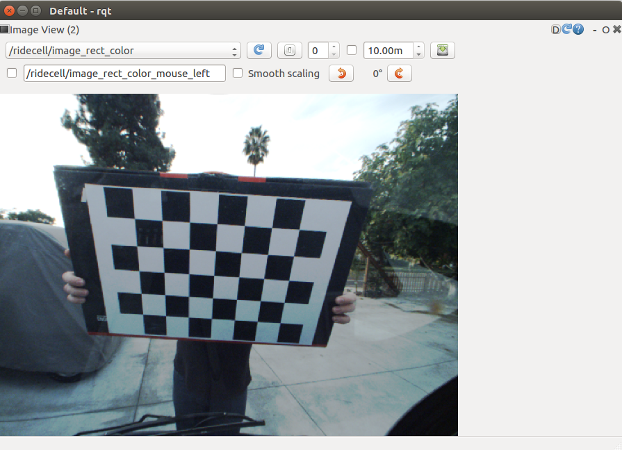

# ridecell-tasks
Platform: Ubuntu 16.4

ROS version: Kinetic


## Tast One: camera calibration
### Get the camera intrinsic calibration parameters
The ros package for camera intrinsic calibration is `camera_calibration`.

The command is `rosrun camera_calibration cameracalibrator.py --size 5x7 --square 0.05 image:=/sensors/camera/image_color camera:=/sensors/camera/camera_info --no-service-check/`, then I run `rosbag play [path-to-bag-file]`

Here is what I got after running `rostopic list`:
```
/clock
/rosout
/rosout_agg
/sensors/camera/camera_info
/sensors/camera/image_color
/sensors/velodyne_points
```
After enough images are collected (for different x, y, skew, and size), I cliked the `Calibrate` botton to start calibration. The caliration results are saved to `/tmp/calibrationdata.tar.gz/` after I cliked the `Save` botton.

The yaml file (now in the `/results/calibrationdata/` folder) stores all the calibrated parameters we will need to rectify images taken from that camera.

### Use the above parameters to update the camera_info topic of the original rosbag file 
The best way to prepare the input for rectifying the images is to modify the original rosbag file by replacing the 'camera_info' topic. 'bag_tools' would be the best option, however it can't be installed on my Ubuntu 16.4 LTE ROS kinetic.

Instead I wrote a script () to subscribe image topic and publish image and camera_info topics with the same timestamp and calibrated camera parameters. This is needed by the next step.


### Launch to play the rosbag and image_proc node to get the rectified images

I wrote the launch file to do the above three nodes.

```xml
<launch>
	<!-- Play the rosbag file to publish original sensor data -->
	<node name="rosbag" pkg="rosbag" type="play" 
	args="$(find ridecell)/bags/2016-11-22-14-32-13_test.bag -l"
	output="screen"
	/>

	<node name="subpub" pkg="ridecell" type="pub_camera_info.py"
	args="$(find ridecell)/config/ost.yaml" 
	/>

	<!-- Run to subscribe topics image_raw and camera_info in namespace, eg., defined in ns="/ridecell" -->
	<node name="image_proc" pkg="image_proc" type="image_proc" ns="/ridecell" output="screen"
	/>
</launch>

```

Then fire up `rqt`, we can view the rectified images by choosing the `/ridecell/image_rect_color`, as shown below:




## Tast Two: lidar-camera extrinsic calibration

The extrinsic parameters of a lidar-camera calibration includes the rotation and translation, which is 6DoF. 2D-3D point correspondence method is used to calculate the tranformation (rotation+translation) between Lidar and camera. 

### The first step is to collect the correspondence points (lidar-3D, camera-2D)
My first problem is to find out how to collect those points. (Set a specific time so that the checkboard is clear to selece corresponding lidar points?)

To view the lidar data together with rectified images, I run the `static_transform_publisher` in `tf` to set base_link and velodyne tranform to be zeros (no rotation, no translation).
```
rosrun tf static_transform_publisher 0.0 0.0 0.0 0.0 0.0 0.0 1.0 base_link velodyne 1000
```
This command is now added to `camera_calibration.launch` and `view_lidar.launch`.


### Then run the optimization algorithm to calibrate the lidar-camera transformation (extrinsics)

### Use the calibrated transformation to output overlayed images


