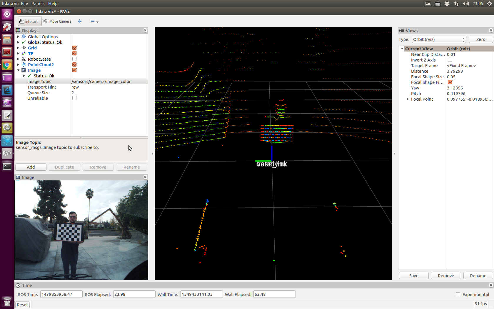

# ridecell-tasks
Platform: Ubuntu 16.4

ROS version: Kinetic


## Tast One: camera calibration
### Get the camera intrinsic calibration parameters
The ros package for camera intrinsic calibration is `camera_calibration`.

The command is `rosrun camera_calibration cameracalibrator.py --size 5x7 --square 0.05 image:=/sensors/camera/image_color camera:=/sensors/camera/camera_info --no-service-check/`, then I run `rosbag play [path-to-bag-file]`

Here is what I got after running `rostopic list`:
```
/clock
/rosout
/rosout_agg
/sensors/camera/camera_info
/sensors/camera/image_color
/sensors/velodyne_points
```
After enough images are collected (for different x, y, skew, and size), I cliked the `Calibrate` botton to start calibration. The caliration results are saved to `/tmp/calibrationdata.tar.gz/` after I cliked the `Save` botton.

The yaml file (now in the `/results/calibrationdata/` folder) stores all the calibrated parameters we will need to rectify images taken from that camera.

### Use the above parameters to update the camera_info topic of the original rosbag file 
The best way to prepare the input for rectifying the images is to modify the original rosbag file by replacing the 'camera_info' topic. 'bag_tools' would be the best option, however it can't be installed on my Ubuntu 16.4 LTE ROS kinetic.

Instead I wrote a script () to subscribe image topic and publish image and camera_info topics with the same timestamp and calibrated camera parameters. This is needed by the next step.


### Launch to play the rosbag and image_proc node to get the rectified images

I wrote the launch file to do the above three nodes.

```xml
<launch>
	<!-- Play the rosbag file to publish original sensor data -->
	<node name="rosbag" pkg="rosbag" type="play" 
	args="$(find ridecell)/bags/2016-11-22-14-32-13_test.bag -l"
	output="screen"
	/>

	<node name="subpub" pkg="ridecell" type="pub_camera_info.py"
	args="$(find ridecell)/config/ost.yaml" 
	/>

	<!-- Run to subscribe topics image_raw and camera_info in namespace, eg., defined in ns="/ridecell" -->
	<node name="image_proc" pkg="image_proc" type="image_proc" ns="/ridecell" output="screen"
	/>
</launch>

```

Then fire up `rqt`, we can view the rectified images by choosing the `/ridecell/image_rect_color`, as shown below:


## Task Two: lidar-camera extrinsic calibration

The extrinsic parameters of a lidar-camera calibration includes the rotation and translation, which is 6DoF. 2D-3D point correspondence method is used to calculate the tranformation (rotation+translation) between Lidar and camera. 

### The first step is to collect the correspondence points (lidar-3D, camera-2D)
-  The first problem is to find out how to collect those points. (Set a specific time so that the checkboard is clear to select corresponding lidar points?) 

- Together with the above problem, now maybe I need to get a rectified rosbag file using a Indigo Ros version (for bag_tools).

    [NO. With the launch file in Task One, we can use `space` to control pause and select the corrensponding lidar and camera frames]

- How to sync a camera frame and a lidar frame?

    [See the answer above.]

- How to select the lidar points within a frame and corresponding camera points in a image?

    [Use rviz. Top menu --> Panels --> Selection. Then add a tool called 'Select' besides 'Move Camera' by clicking the `plus` button. After that, choose `Select` and click a lidar point in the rviz gui, then in the `Selection` panel you will see the 3D point (x, y, z).]

    Reference: how to point and click on rviz map and output the position (https://answers.ros.org/question/69019/how-to-point-and-click-on-rviz-map-and-output-the-position/)

- However, to select the corresponding points in the image, we need to save the rectified image of original size. 

    [We can save the image of original size using `image_view` by setting `autosize=true`.]

    I wrote a script(`collect_image_points`) to manually select the points of interest in the image given the path as the command line arguement.


To view the lidar data together with rectified images, I run the `static_transform_publisher` in `tf` to set base_link and velodyne tranform to be zeros (no rotation, no translation).
```
rosrun tf static_transform_publisher 0.0 0.0 0.0 0.0 0.0 0.0 1.0 base_link velodyne 1000
```
This command is now added to `camera_calibration.launch` and `view_lidar.launch`.

```xml
<launch>
	<!-- Play the rosbag file to publish original sensor data -->
	<node name="rosbag" pkg="rosbag" type="play" 
	args="--clock $(find ridecell)/bags/2016-11-22-14-32-13_test.bag -l"
	output="screen"
	/>

    <!-- rosrun tf static_transform_publisher 0.0 0.0 0.0 0.0 0.0 0.0 1.0 base_link velodyne 1000 -->
    <node name="static_transform" pkg="tf" type="static_transform_publisher"
    args="0.0 0.0 0.0 0.0 0.0 0.0 1.0 base_link velodyne 1000"
    />
</launch>
```
Here is a screenshot of the rviz window visualizing lidar data and rectified image.



Then the collected six lidar-image point pairs are stored in a json file for calcuating the transfrom using optimization method.


### Then run the optimization algorithm to calibrate the lidar-camera transformation (extrinsics)

The basic logic behind this is to minimize the reprojections errors. The correspondence 3D-2D points and camera params are passed to the calibration script. A pinhole camera model is defined and initialized with the camera intrinsics params, which is used reproject the 3D lidar points to image space. Actually the number of correspondence points can be variable. For a better estimation, spatial uniformly distributed points are recommended. However, precision of the selected points is also important.

Here I start the optimization by firing up the command:
```
rosrun ridecell calibrate_lidar_camera.py config/lidar_image_points.json config/ost.yaml
```

Here is the terminal output:
```
Optimization terminated successfully.    (Exit mode 0)
            Current function value: 22.8676357989
            Iterations: 59
            Function evaluations: 561
            Gradient evaluations: 59
Calibration done ...
Final transformation:
[-0.53831089 -0.076088   -0.41682017  2.67673445  4.53119823  5.19606972]
```

### Use the calibrated transformation to output overlayed images

Now that we got a rough estimation of the lidar-camera transformation, we can move on to create lidar-image overlay. To be more precific, this transformation is from camera to lidar, which means we see the camear frame as the world frame.


